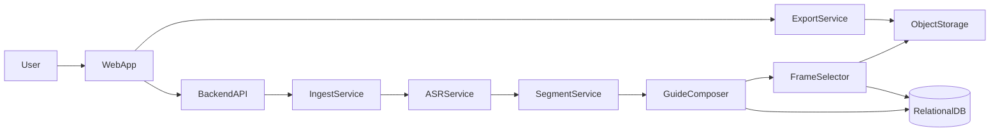
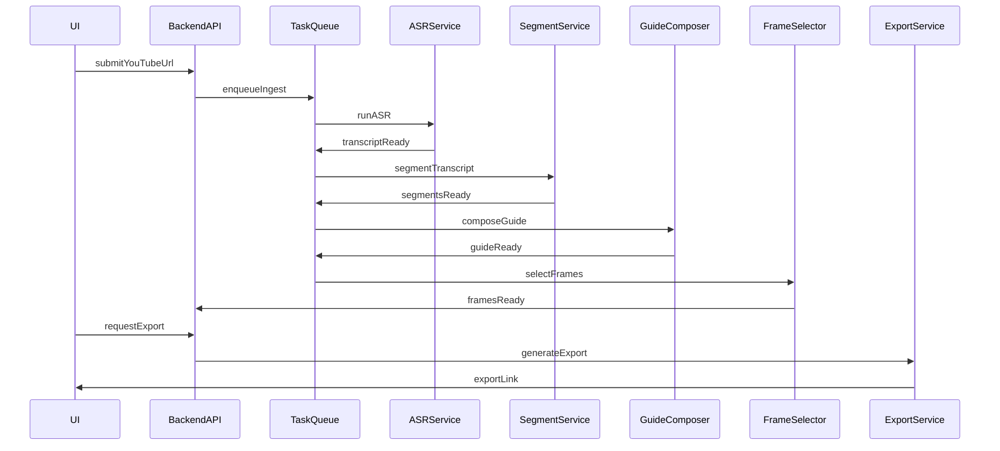

# Архитектура и план MVP (краткая версия)

## 1. Обзор продукта

Сервис превращает длинные YouTube-видео в структурированные текстовые гайды с шагами и иллюстрациями. Гайд можно редактировать и экспортировать в популярные форматы.

## 2. Цели MVP

- URL YouTube → готовый гайд.
- Редактирование шагов и иллюстраций.
- Экспорт в Markdown и PDF.
- Один язык на старте (уточняется).

## 3. Архитектура (верхнеуровнево)

- WebApp (SPA): импорт, редактор гайда, экспорт.
- Backend API: оркестрация и хранение.
- Worker: фоновые задачи (ASR, сегментация, кадры).
- Storage: видео/кадры.
- DB: метаданные и версии.
- ML Runtime: локальные модели (Whisper/Vosk для ASR, Ollama для LLM) или внешние провайдеры.
- Доступ: приватные гайды по умолчанию, опциональный шаринг по ссылке (read-only).

## 4. Пайплайн обработки

1. Ingest: загрузка видео/аудио.
2. ASR: транскрипт с таймкодами (Whisper/Vosk локально или внешний API).
3. Segment: логические фрагменты.
4. Compose: шаги гайда (LLM через Ollama или внешний API).
5. FrameSelector: кадры для шагов.
6. Export: формирование файлов.

## 5. Модель данных (сокращенно)

- User: id, role
- VideoSource: url, duration, status, provider
- Transcript: language, segments (text + timecodes)
- Guide: title, steps, version, status
- GuideStep: text, startTime, endTime
- Frame: timestamp, imageUrl, score
- Export: type, fileUrl, createdAt
- GuideAccess: userId, role
- ShareLink: token, expiresAt

## 6. Риски

- Стоимость ASR/LLM → лимит длительности на MVP.
- Права на контент YouTube → соблюдение ToS.
- Качество сегментации → требуется ручная правка.
- Локальные модели требуют ресурсов (CPU/GPU, RAM, диски моделей).
- Ретенция данных влияет на стоимость хранения и юридические риски.

## 7. Связанные документы

- `docs/overview.md`
- `docs/architecture.md`
- `docs/data-model.md`
- `docs/pipeline.md`
- `docs/api.md`
- `docs/ui-flow.md`
- `docs/plan.md`
- `docs/risks.md`
- `docs/security.md`
- `docs/infra.md`
- `docs/testing.md`
- `docs/runbook.md`
- `docs/architecture-decisions.md`
- `docs/checklist.md`
- `docs/roadmap.md`
- `docs/scope.md`
- `docs/ops-metrics.md`
- `docs/data-retention.md`
- `docs/onboarding.md`
- `docs/config.md`
- `docs/deployment.md`
- `docs/glossary.md`
- `docs/backlog.md`
