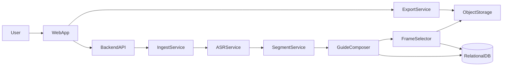
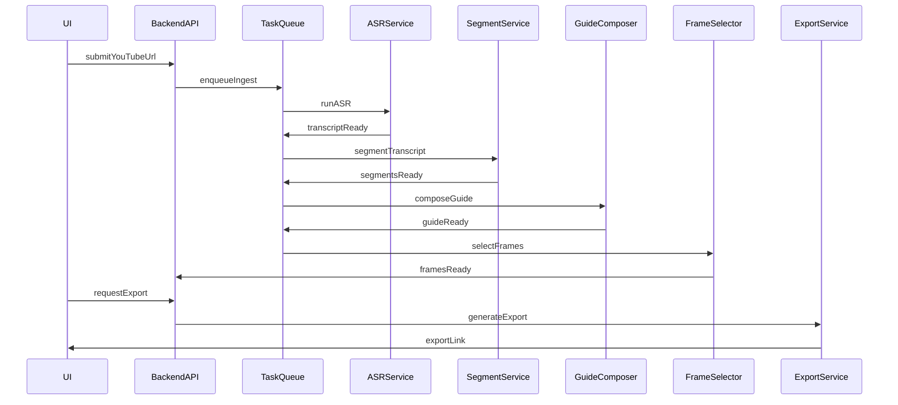

# TranScript — Архитектура и план MVP

Сервис превращает длинные YouTube-видео в структурированные текстовые гайды с шагами и иллюстрациями. Гайды можно редактировать и экспортировать в популярные форматы.

## Содержание
- [Цели MVP](#цели-mvp)
- [Архитектура (верхнеуровнево)](#архитектура-верхнеуровнево)
- [Пайплайн обработки](#пайплайн-обработки)
- [Модель данных (сокращенно)](#модель-данных-сокращенно)
- [Риски](#риски)
- [Документация](#документация)

## Цели MVP
- URL YouTube → готовый гайд.
- Редактирование шагов и иллюстраций.
- Экспорт в Markdown и PDF.
- Один язык на старте (уточняется).

## Архитектура (верхнеуровнево)
- WebApp (SPA): импорт, редактор гайда, экспорт.
- Backend API: оркестрация и хранение.
- Worker: фоновые задачи (ASR, сегментация, кадры).
- Storage: видео/кадры.
- DB: метаданные и версии.
- ML Runtime: локальные модели (Whisper/Vosk для ASR, Ollama для LLM) или внешние провайдеры.
- Доступ: приватные гайды по умолчанию, опциональный шаринг по ссылке (read-only).

## Пайплайн обработки
1. Ingest: загрузка видео/аудио.
2. ASR: транскрипт с таймкодами (Whisper/Vosk локально или внешний API).
3. Segment: логические фрагменты.
4. Compose: шаги гайда (LLM через Ollama или внешний API).
5. FrameSelector: кадры для шагов.
6. Export: формирование файлов.

## Модель данных (сокращенно)
- User: id, role
- VideoSource: url, duration, status, provider
- Transcript: language, segments (text + timecodes)
- Guide: title, steps, version, status
- GuideStep: text, startTime, endTime
- Frame: timestamp, imageUrl, score
- Export: type, fileUrl, createdAt
- GuideAccess: userId, role
- ShareLink: token, expiresAt

## Риски
- Стоимость ASR/LLM → лимит длительности на MVP.
- Права на контент YouTube → соблюдение ToS.
- Качество сегментации → требуется ручная правка.
- Локальные модели требуют ресурсов (CPU/GPU, RAM, диски моделей).
- Ретенция данных влияет на стоимость хранения и юридические риски.

## Документация

### Продукт и требования
- [Overview](docs/overview.md)
- [Scope](docs/scope.md)
- [Roadmap](docs/roadmap.md)
- [Backlog](docs/backlog.md)

### Архитектура и данные
- [Architecture](docs/architecture.md)
- [Data Model](docs/data-model.md)
- [Pipeline](docs/pipeline.md)
- [API](docs/api.md)
- [ADR](docs/architecture-decisions.md)
- [Glossary](docs/glossary.md)

### UX и контент
- [UI Flow](docs/ui-flow.md)
- [Plan](docs/plan.md)

### Операции и безопасность
- [Security](docs/security.md)
- [Infrastructure](docs/infra.md)
- [Deployment](docs/deployment.md)
- [Configuration](docs/config.md)
- [Runbook](docs/runbook.md)
- [Ops Metrics](docs/ops-metrics.md)
- [Data Retention](docs/data-retention.md)

### QA и процессы
- [Testing](docs/testing.md)
- [Checklist](docs/checklist.md)
- [Onboarding](docs/onboarding.md)
