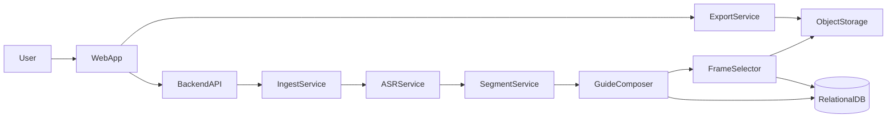
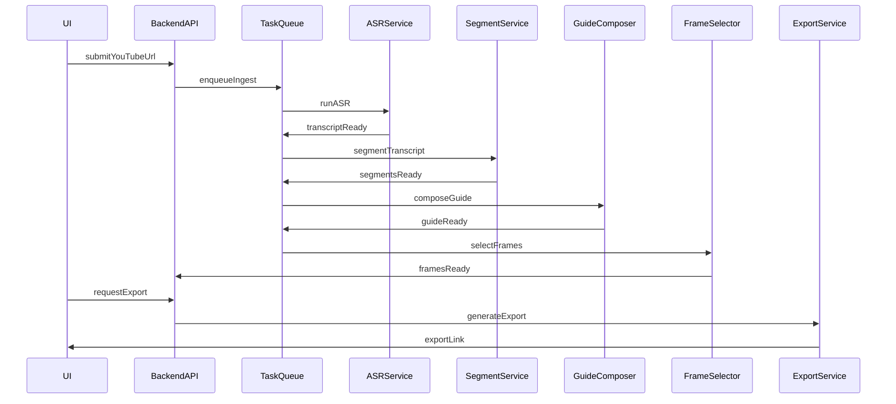

# Architecture

## 1. Компоненты

- **WebApp**: импорт, редактор, экспорт, управление кадрами.
- **Backend API**: оркестрация, хранение, права доступа.
- **Worker**: фоновые задачи (ASR, сегментация, кадры, экспорт).
- **Storage**: видео и кадры.
- **DB**: метаданные, версии, статусы.
- **ML Runtime**: локальные модели ASR/LLM и менеджер их жизненного цикла.

## 2. Сервисы

- **IngestService**: получает ссылку YouTube, скачивает видео/аудио.
- **ASRService**: делает транскрипт с таймкодами (Whisper/Vosk или внешний API).
- **SegmentService**: разбивает текст на шаги/разделы.
- **GuideComposer**: формирует шаги в виде инструкций (LLM через Ollama или внешний API).
- **FrameSelector**: выбирает кадры по таймкодам.
- **ExportService**: генерирует PDF/MD.

## 3. Локальные модели и провайдеры

**ASR (локально):**

- Whisper (точность выше, ресурсоемкость выше).
- Vosk (легче по ресурсам, возможна меньшая точность).

**LLM (локально):**

- Ollama как слой запуска моделей.
- Модели: Llama 3, Mistral, Gemma (выбор зависит от ресурсов).

**Провайдеры (внешние):**

- ASR/LLM через API при необходимости качества/скорости.

**Принцип выбора:**

- Для MVP — единая абстракция провайдера с режимами `local` / `remote`.

## 4. Доступ и безопасность

- Аутентификация: токены (JWT/сессии) в зависимости от выбранного стека.
- Авторизация: доступ к гайдам и видео только владельцу.
- Логи аудита: основные события (создание, экспорт, удаление).

## 5. Модель доступа и совместная работа

- MVP: приватные гайды, доступ только владельцу.
- Шаринг по ссылке (read-only) через отдельную сущность.
- Совместное редактирование — не в MVP, но модель данных готова.

## 6. Жизненный цикл данных

- Политика ретенции конфигурируется (по умолчанию):
  - raw видео/аудио: 7 дней после успешной обработки,
  - кадры: 30 дней,
  - экспорты: 30 дней.
- Удаление по запросу пользователя удаляет все производные артефакты.

## 7. Поток данных

## 8. Пайплайн (взаимодействия)

## 9. Связанные документы

- `docs/data-model.md`
- `docs/pipeline.md`
- `docs/security.md`
- `docs/infra.md`
- `docs/testing.md`
- `docs/runbook.md`
- `docs/architecture-decisions.md`
- `docs/checklist.md`
- `docs/roadmap.md`
- `docs/scope.md`
- `docs/ops-metrics.md`
- `docs/data-retention.md`
- `docs/onboarding.md`
- `docs/config.md`
- `docs/deployment.md`
- `docs/glossary.md`
- `docs/backlog.md`
